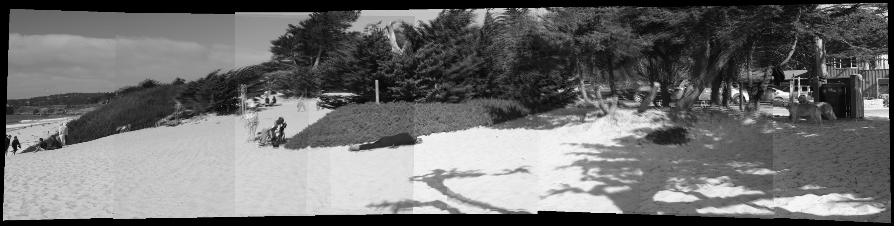

# Automatic panorama stitching
Automatic panorama stitching of multiple images given the rotation (*R*) and camera intrinsics (*K*) matrices after the bundle adjustment procedure. If the reference image's rotation (R) matrix is represented by an identity matrix, this program will find the index of reference image automatically. If you need to override this option, pass the index of the reference image as an input argument. If the algorithm cannot find an identity matrix or the index of the reference image is not passed as an input argument, then first image in the images cell array will be choosen as the reference image. All the transformations will be made with reference to the reference image.

There are two functions, `stitchImages_tightROI` and `stitchImages_largeROI`. First function (`stitchImages_tightROI`) finds the canvas bounds automatically and saves the memory and compuational time. In constrast, `stitchImages_largeROI` considers a 3-times larger canvas than the input image size, which is slower and memory intensive.

These functions are individual components given the rotation (*R*) and camera intrinsics (*K*) matrices after the bundle adjustment procedure. In addition these two functions includes the `imWarp`, a highly vectorized implementation of image warping functionality using the `nearest`, `bilinear`, or `bicubic` interpolation and a simaple `Feathering` blending from the scratch without using the `MATLAB` toolboxes,except `fspecial` function for Gaussian smoothing. If the `MATLAB Parallel Computing Toolbox` is not available, please change the `parfor` to `for` in all the functions.

For the full automatic panorama stitching functionality with feature extraction, image matching, bundle adjustment, gain compensation and multiband blending, as given in the paper [Automatic Panoramic Image Stitching using Invariant Features (AutoStitch)](https://link.springer.com/article/10.1007/s11263-006-0002-3). Please refer to the [AutoPanoStitch](https://github.com/preethamam/AutomaticPanoramicImageStitching-AutoPanoStitch) library.

# Stitched images:
| Images |
| ------ |
| No blending | 
|  |
| Feathering | 
|  |

# Requirements
MATLAB  
MATLAB Image Processing Toolbox  
MATLAB Parallel Computing Toolbox

# Feedback
Please rate and provide feedback for the further improvements.
